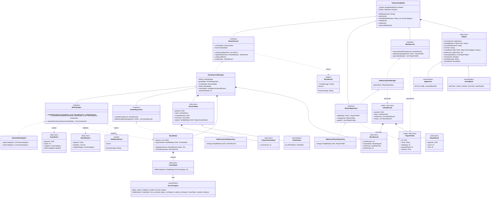

****### Yahtzee assistant

```mermaid
classDiagram

    %% --- PRESENTATION (GUI Layer) ---

    class YahtzeeViewModel {
        - _uiState: MutableStateFlow~UIState~
        + uiState: StateFlow~UIState~
        + addPlayer(name: String)
        + startGame()
        + submitMove(diceInput: String, cat: ScoreCategory)
        + undoMove()
        + endGame()
        + showLeaderBoard()
    }

    class UIState {
        <<data class>>
        + currentScreen: AppScreen
        + pendingPlayers: Map~UUID, String~
        + currentPlayerName: String
        + errorText: String
        + scoreBoard: Map~UUID, Map~ScoreCategory, String~~
        + totalScores: Map~UUID, Int~
        + finalLeaderBoard: List~PlayerProfile~
        + isGameOver: Boolean
        + assistMessage: String
        + assistMood: AssistMood
    }

    class AppScreen {
        <<enumeration>>
        SETUP, GAME, LEADERBOARD
    }

    class AssistMood {
        <<enumeration>>
        NEUTRAL, HAPPY, ANGRY, EXCITED, SURPRISED
    }

    %% --- APPLICATION ---

    class IGameSession {
        <<interface>>
        + currentState: SessionState
        + board: BoardState
        + startGame(playerIds: List~UUID~)
        + registerMove(move: MoveRequest) MoveResult
        + undoLastMove()
        + endGame() GameRecord
    }

    class GameSessionManager {
        - referee: IRulesEngine
        - gameRepo: IGameRepository
        + currentState: SessionState
        + board: BoardState
        + moveHistory: MutableList~MoveRecord~
        - currentPlayerIdx: Int
    }

    class IStatsService {
        <<interface>>
        + processGameResult(record: GameRecord)
        + getPlayerStats(playerId: UUID) PlayerProfile
        + getLeaderBoard() List~PlayerProfile~
    }

    class InMemoryStatsManager {
        - playerRepo: IPlayerRepository
    }

    class GameStatus {
        <<enumeration>>
        IN_PROGRESS, FINISHED
    }

    %% --- DOMAIN ---

    class IRulesEngine {
        <<interface>>
        + validateMove(board: BoardState, move: MoveRequest) ValidationResult
        + calculateIntermediateScore(board: BoardState, move: MoveRequest) ScoreEvent
        + calculateFinalScore(board: BoardState) List~ScoreEvent~
    }
    
    class YahtzeeRulesEngine {
        - upperCategories: List~ScoreCategory~
        - lowerCategories: List~ScoreCategory~
    }

    class ValidationResult {
        <<sealed>>
        Correct
        Error(message: String)
    }

    class BoardState {
        + players: List~UUID~
        + playerSheets: MutableMap~UUID, ScoreSheet~
        + applyMove(move: MoveRequest, points: Int)
        + revertMove(record: MoveRecord)
    }

    class ScoreSheet {
        <<data class>>
        + filledCategories: MutableMap~ScoreCategory, Int~
    }

    class ScoreCategory {
        <<enumeration>>
        ONES, TWOS, THREES, FOURS, FIFTHS, SIXES...
        THREEKIND, FOURKIND, FULL_HOUSE, SMALL_STRAIGHT, LARGE_STRAIGHT, YAHTZEE, CHANCE, BONUS
    }

    class MoveResult {
        <<sealed>>
        + errorMessage: String?
        Success
        Error(message: String)
    }

    class MoveRequest {
        <<data class>>
        + playerID: UUID
        + finalDice: List~Int~ 
        + targetCategory: ScoreCategory 
    }

    class MoveRecord {
        <<data class>>
        + moveNumber: Int
        + requestData: MoveRequest
        + timestamp: LocalDateTime
        + pointScored: Int
    }

    class SessionState {
        <<data class>>
        + gameId: UUID
        + status: GameStatus
        + currentPlayerId: UUID
        + turnOrder: List~UUID~
        + players: MutableMap~UUID, PlayerInGameState~
    }

    class PlayerInGameState {
        <<data class>>
        + currentScore: Int
    }

    class ScoreEvent {
        <<data class>>
        + playerID: UUID
        + points: Int
        + category: ScoreCategory
        + isBonusApplied: Boolean 
    }

    %% --- DATA / REPOSITORIES ---

    class IPlayerRepository {
        <<interface>>
        + getById(id: UUID) PlayerProfile? 
        + save(profile: PlayerProfile)
        + getAll() List~PlayerProfile~
    }
    
    class InMemoryPlayerRepository {
        - storage: MutableMap~UUID, PlayerProfile~
    }

    class IGameRepository {
        <<interface>>
        + saveRecord(record: GameRecord)
        + getHistoryByPlayer(playerId: UUID) List~GameRecord~
    }
    
    class InMemoryGameRepository {
        - storage: MutableMap~UUID, GameRecord~
    }

    class PlayerProfile {
        <<entity / data class>>
        + id: UUID
        + name: String
        + eloRating: Int
        + gamesPlayed: Int
        + winRate: Float
    }

    class GameRecord {
        <<entity / data class>>
        + gameId: UUID
        + date: LocalDateTime
        + finalScores: List~PlayerResult~
        + history: List~MoveRecord~
    }
    
    class PlayerResult {
        <<data class>>
        + playerId: UUID
        + score: Int
        + rank: Int
    }

    %% --- RELATIONSHIPS ---

    BoardState *-- "*" ScoreSheet : contains
    ScoreSheet o-- ScoreCategory : uses

    IGameSession <|.. GameSessionManager
    IStatsService <|.. InMemoryStatsManager
    IRulesEngine <|.. YahtzeeRulesEngine
    IPlayerRepository <|.. InMemoryPlayerRepository
    IGameRepository <|.. InMemoryGameRepository
    
    GameSessionManager o-- IRulesEngine
    GameSessionManager o-- IGameRepository
    GameSessionManager *-- SessionState
    GameSessionManager *-- BoardState
    GameSessionManager *-- "0..*" MoveRecord
    
    InMemoryStatsManager o-- IPlayerRepository
    InMemoryStatsManager ..> GameRecord : processes
    
    IRulesEngine ..> ScoreEvent : creates
    IRulesEngine ..> BoardState : inspects
    IRulesEngine ..> MoveRequest : validates
    IRulesEngine ..> ValidationResult : returns
    
    SessionState *-- "*" PlayerInGameState
    SessionState o-- GameStatus
    GameRecord *-- "*" MoveRecord
    GameRecord *-- "*" PlayerResult
    IGameSession ..> MoveResult : returns
    IPlayerRepository ..> PlayerProfile : manages
    IStatsService ..> PlayerProfile : uses/returns
    
    YahtzeeViewModel o-- IGameSession
    YahtzeeViewModel o-- IPlayerRepository
    YahtzeeViewModel o-- IStatsService
    YahtzeeViewModel *-- UIState
    UIState o-- AppScreen
    UIState o-- AssistMood
```
