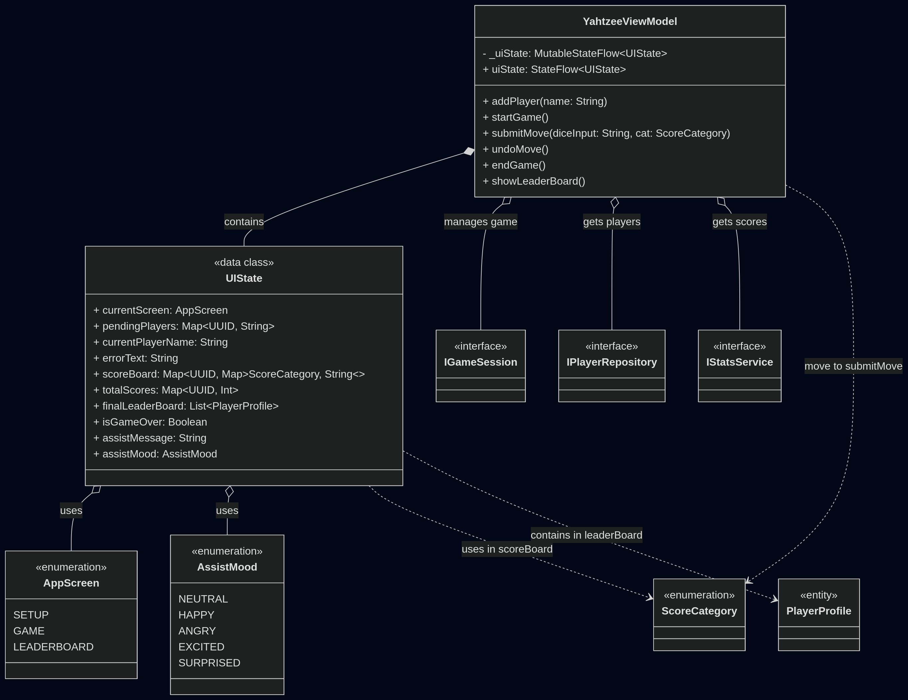
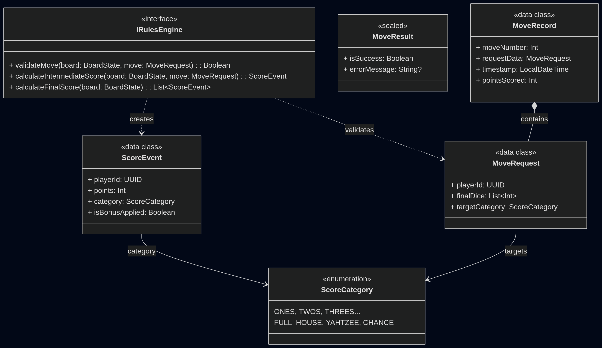
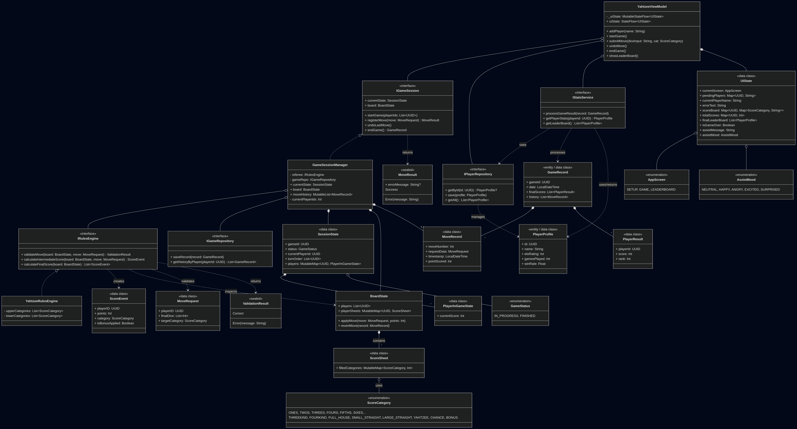
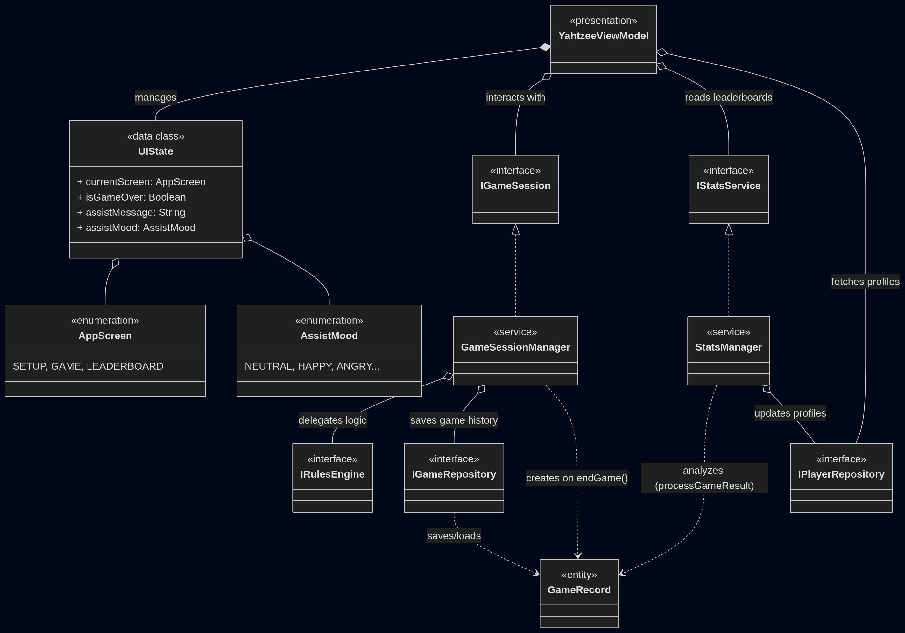

# Yahtzee Assistant

Десктопное приложение для администрирования игры Yahtzee с интерактивным ассистентом.

---

## Описание

Yahtzee Assistant — это реализация администрирование партий настольной игры Yahtzee для нескольких игроков с умным ассистентом, который комментирует ходы, отслеживает очки, ведёт историю партий и хранит рейтинг игроков.

---

## Стек технологий

- **Kotlin** — основной язык разработки
- **Compose Multiplatform (Desktop)** — декларативный UI
- **Exposed** — ORM для работы с базой данных
- **SQLite** — персистентное хранение данных об игроках и партиях
- **JUnit 5 / Kotlin Test** — модульные и интеграционные тесты

---

## Архитектура

Проект строго следует принципу разделения ответственности и разбит на четыре слоя.

```
presentation  →  application  →  domain  →  data
```

**`domain`** — чистая бизнес-логика без зависимостей:
- `YahtzeeRulesEngine` — подсчёт очков, начисление бонусов, валидация ходов
- `BoardState`, `ScoreSheet`, `MoveRequest`, `ScoreCategory` — доменные модели

**`application`** — оркестрация игровой сессии:
- `GameSessionManager` — управление очерёдностью ходов, отмена ходов, завершение партии
- `IGameSession` — интерфейс сессии, абстрагирующий слой от UI

**`data`** — хранение:
- `SqliteGameRepository` / `SqlitePlayerRepository` — реализации через Exposed
- `InMemoryGameRepository` / `InMemoryPlayerRepository` — in-memory варианты для тестов
- `InMemoryStatsManager` — ELO-рейтинг и win rate

**`gui`** — презентационный слой:
- `YahtzeeViewModel` — единственная точка взаимодействия UI с бизнес-логикой
- `YahtzeeScreen.kt` — функции для отображения всех трёх экранов

### Диаграммы классов

<details>
<summary>GUI / ViewModel слой</summary>



</details>

<details>
<summary>Domain слой (Rules Engine)</summary>



</details>

<details>
<summary>Полная диаграмма системы</summary>



</details>

<details>
<summary>Архитектура сервисов</summary>



</details>

---

## Экраны приложения

**Setup** — регистрация игроков (новых или существующих по имени), запуск партии.

**Game** — основной экран с таблицей очков для всех игроков, полем ввода кубиков и панелью ассистента.

**Leaderboard** — финальная таблица с ELO-рейтингом и win rate всех когда-либо зарегистрированных игроков.

---

## Ассистент

Персонаж-комментатор меняет настроение (`AssistMood`) в зависимости от игровой ситуации:

| Mood | Когда появляется |
|------|-----------------|
| `NEUTRAL` | Стандартный ход |
| `HAPPY` | Набрано > 0 очков |
| `EXCITED` | Yahtzee или ≥ 30 очков |
| `SURPRISED` | Ошибка, undo или 0 очков |
| `ANGRY` | Некорректный формат ввода |

---

## Правила подсчёта очков

**Верхняя секция** — сумма выпавших граней нужного номинала (1–6).  
**Бонус верхней секции** — +35 очков, если сумма верхней секции ≥ 63.

| Категория | Условие | Очки |
|-----------|---------|------|
| Three of a Kind | ≥ 3 одинаковых | Сумма всех кубиков |
| Four of a Kind | ≥ 4 одинаковых | Сумма всех кубиков |
| Full House | 3 + 2 (или 5 одинаковых) | 25 |
| Small Straight | Последовательность из 4 | 30 |
| Large Straight | Последовательность из 5 | 40 |
| Yahtzee | 5 одинаковых | 50 |
| Chance | Любые кубики | Сумма всех кубиков |

**Правило Joker** — повторный Yahtzee даёт +100 очков бонуса к любой выбранной категории.

---

## Структура проекта

```
src/
├── main/kotlin/
│   ├── application/
│   │   ├── interfaces/       # IGameSession
│   │   ├── models/           # SessionState, MoveResult, GameStatus
│   │   └── services/         # GameSessionManager
│   ├── data/
│   │   ├── database/         # Exposed таблицы (SQLite схема)
│   │   ├── models/           # PlayerProfile, GameRecord, PlayerResult
│   │   └── repositories/     # Sqlite- и InMemory-реализации
│   ├── domain/
│   │   ├── engine/           # IRulesEngine, YahtzeeRulesEngine
│   │   └── models/           # BoardState, ScoreSheet, MoveRequest, ScoreCategory и др.
│   └── gui/
│       ├── ViewModel.kt      # YahtzeeViewModel, UIState, AppScreen, AssistMood
│       └── YahtzeeScreen.kt  # Composable UI
└── test/kotlin/
    ├── YahtzeeRulesEngineTest.kt
    ├── GameSessionManagerTest.kt
    ├── GameIntegrationTest.kt
    ├── YahtzeeViewModelTest.kt
    └── SqlitePlayerRepositoryTest.kt
```

---

## Запуск

**Требования:** JDK 17+, Gradle 8+

```bash
# Клонировать репозиторий
git clone <https://github.com/PavelSapegin/Yahtzee_game>
cd Yahtzee_game

# Запустить приложение
./gradlew run

# Запустить тесты
./gradlew test
```

База данных `yahtzee.db` создаётся автоматически в рабочей директории при первом запуске.

---

## Тесты

Проект покрыт тестами на каждом слое:

- **`YahtzeeRulesEngineTest`** — unit-тесты всех категорий
- **`GameSessionManagerTest`** — смена хода, отмена, защита от хода чужим игроком
- **`GameIntegrationTest`** — полная партия от старта до обновления ELO двух игроков
- **`YahtzeeViewModelTest`** — реакция UI-состояния на Yahtzee и повторную категорию
- **`SqlitePlayerRepositoryTest`** — сохранение и обновление профилей через in-memory SQLite

---
