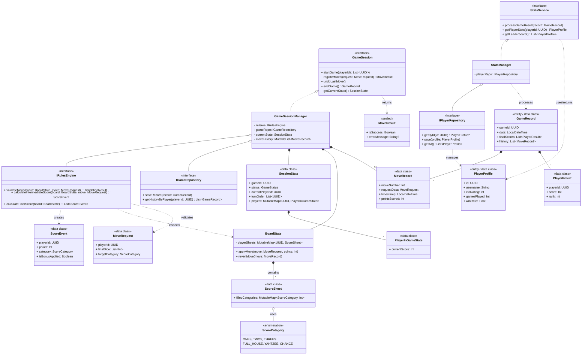

****### Yahtzee assistant

```mermaid
classDiagram

    %% APPLICATION

    class IGameSession {
        <<interface>>
        + startGame(playerIds: List~UUID~)
        + registerMove(request: MoveRequest) MoveResult
        + undoLastMove()
        + endGame() GameRecord
        + getCurrentState() SessionState
    }

    class GameSessionManager {
        - referee: IRulesEngine
        - gameRepo: IGameRepository
        - currentState: SessionState
        - moveHistory: MutableList~MoveRecord~
    }

    class IStatsService {
        <<interface>>
        + processGameResult(record: GameRecord)
        + getPlayerStats(playerId: UUID) PlayerProfile
        + getLeaderboard() List~PlayerProfile~
    }

    class StatsManager {
        - playerRepo: IPlayerRepository
    }

    %% DOMAIN 

    class IRulesEngine {
        <<interface>>
        + validateMove(board: BoardState, move: MoveRequest): ValidationResult
        + calculateIntermediateScore(board: BoardState, move: MoveRequest): ScoreEvent
        + calculateFinalScore(board: BoardState): List~ScoreEvent~
    }

    class BoardState {
        - playerSheets: MutableMap~UUID, ScoreSheet~
        + applyMove(move: MoveRequest, points: Int)
        + revertMove(move: MoveRecord)
    }

    class ScoreSheet {
        <<data class>>
        + filledCategories: MutableMap~ScoreCategory, Int~
    }

    class ScoreCategory {
        <<enumeration>>
        ONES, TWOS, THREES...
        FULL_HOUSE, YAHTZEE, CHANCE
    }

    class MoveResult {
        <<sealed>>
        + isSuccess: Boolean
        + errorMessage: String?
    }

    class MoveRequest {
        <<data class>>
        + playerId: UUID
        + finalDice: List~Int~ 
        + targetCategory: ScoreCategory 
    }

    class MoveRecord {
        <<data class>>
        + moveNumber: Int
        + requestData: MoveRequest
        + timestamp: LocalDateTime
        + pointsScored: Int
    }

    class SessionState {
        <<data class>>
        + gameId: UUID
        + status: GameStatus
        + currentPlayerId: UUID
        + turnOrder: List~UUID~
        + players: MutableMap~UUID, PlayerInGameState~
    }

    class PlayerInGameState {
        <<data class>>
        + currentScore: Int
    }

    class ScoreEvent {
        <<data class>>
        + playerId: UUID
        + points: Int
        + category: ScoreCategory
        + isBonusApplied: Boolean 
    }

    class IPlayerRepository {
        <<interface>>
        + getById(id: UUID) PlayerProfile? 
        + save(profile: PlayerProfile)
        + getAll() List~PlayerProfile~
    }

    class IGameRepository {
        <<interface>>
        + saveRecord(record: GameRecord)
        + getHistoryByPlayer(playerId: UUID) List~GameRecord~
    }

    class PlayerProfile {
        <<entity / data class>>
        + id: UUID
        + username: String
        + eloRating: Int
        + gamesPlayed: Int
        + winRate: Float
    }

    class GameRecord {
        <<entity / data class>>
        + gameId: UUID
        + date: LocalDateTime
        + finalScores: List~PlayerResult~
        + history: List~MoveRecord~
    }
    
    class PlayerResult {
        <<data class>>
        + playerId: UUID
        + score: Int
        + rank: Int
    }

    BoardState *-- "*" ScoreSheet : contains
    ScoreSheet o-- ScoreCategory : uses

    IGameSession <|.. GameSessionManager
    IStatsService <|.. StatsManager
    
    GameSessionManager o-- IRulesEngine
    GameSessionManager o-- IGameRepository
    GameSessionManager *-- SessionState
    GameSessionManager *-- BoardState
    GameSessionManager *-- "0..*" MoveRecord
    
    StatsManager o-- IPlayerRepository
    StatsManager ..> GameRecord : processes
    
    IRulesEngine ..> ScoreEvent : creates
    IRulesEngine ..> BoardState : inspects
    IRulesEngine ..> MoveRequest : validates
    
    SessionState *-- "*" PlayerInGameState
    GameRecord *-- "*" MoveRecord
    GameRecord *-- "*" PlayerResult
    IGameSession ..> MoveResult : returns
    IPlayerRepository ..> PlayerProfile : manages
    IStatsService ..> PlayerProfile : uses/returns
```
